# QBoss - Advanced KDE Window Manager



QBoss is a feature-rich TUI (Text User Interface) for KDE Wayland environments, designed to provide power users with comprehensive window management capabilities through an elegant and intuitive interface.

[](https://github.com/eraxe/qboss/releases)
[](LICENSE)

## 🌟 Features

- **Window Management**
  - List, search, and filter windows
  - Activate, minimize, maximize, and close windows
  - Monitor window creation and destruction
  - Capture window properties on click

- **DBus Integration**
  - Explore DBus services
  - Execute custom qdbus commands
  - Generate shell scripts for window interactions

- **Clipboard Operations**
  - Copy window IDs, classes, and titles to clipboard
  - Access clipboard history

- **App Helper**
  - Save apps for quick access and toggling
  - Launch or toggle apps with a single command

- **Configuration**
  - Customizable settings
  - Theme support (including Synthwave!)
  - Log level control

## 📋 Requirements

- KDE Plasma with Wayland
- The following dependencies:
  - `gum` (Charm gum - TUI toolkit)
  - `glow` (Markdown renderer)
  - `qdbus` (Qt DBus tool)
  - `wl-copy` (Wayland clipboard tool)
  - `jq` (JSON processor)
  - `curl` (HTTP client)
  - `gtk-launch` (GTK application launcher)

## 🚀 Installation

### Option 1: Quick Install

```bash
sudo ./qboss.sh --install
```

### Option 2: Manual Installation

1. Clone the repository:
   ```bash
   git clone https://github.com/eraxe/qboss.git
   cd qboss
   ```

2. Make the script executable:
   ```bash
   chmod +x qboss.sh
   ```

3. Install to system (optional):
   ```bash
   sudo ./qboss.sh --install
   ```

### Installing Dependencies

#### On Arch Linux:
```bash
sudo pacman -S charm-gum glow qt5-tools wl-clipboard jq curl gtk3
```

#### On Debian/Ubuntu:
```bash
sudo apt install charm-gum glow qt5-default wl-clipboard jq curl libgtk-3-bin
```

## 💻 Usage

### Command-Line Options

```
qboss [options] [command] [app-name]

Options:
  -h, --help                Show help message
  -v, --version             Show version information
  -i, --install             Install QBoss to system
  -u, --update              Update QBoss to the latest version
  -r, --remove              Remove QBoss from system
  -c, --config              Open configuration settings
  -t, --theme <theme>       Use specified theme
  -l, --log-level <level>   Set log level (debug, info, warn, error)
  --compact                 Use compact view mode
  --no-color                Disable colored output

Commands:
  list                      List all windows
  search <term>             Search windows by term
  class [filter]            List window classes with optional filter
  info <window_id>          Show window information
  activate <window_id>      Activate specified window
  minimize <window_id>      Minimize specified window
  maximize <window_id>      Maximize specified window
  close <window_id>         Close specified window
  monitor                   Monitor window creation/destruction
  click                     Capture window properties on click
  service [filter]          List DBus services with optional filter
  exec <command>            Execute custom qdbus command
  script <window_id>        Generate shell script for window interaction
  copy <window_id> <type>   Copy window property to clipboard (id|class|title)
  apps                      Manage saved applications
  app-save <name>           Save current clicked window as an app
  app-list                  List saved applications
  app-delete <name>         Delete a saved application

App Helper:
  <app-name>                Launch or toggle a saved application
```

### Interactive Mode

Simply run `qboss` without any arguments to enter the interactive TUI mode with a menu-based interface.

### Examples

```bash
# Start interactive TUI
qboss

# List all windows
qboss list

# Search for Firefox windows
qboss search firefox

# Copy class of window 12345 to clipboard
qboss copy 12345 class

# Save clicked Firefox window as app
qboss app-save firefox

# Launch/toggle Firefox
qboss firefox
```

## ⚙️ Configuration

QBoss configurations are stored in `~/.config/qboss/`:

- `config.json`: Main configuration file
- `apps.json`: Saved applications
- `themes/`: Theme files
- `logs/`: Log files

You can modify these settings through the configuration menu (`qboss -c`) or by editing the files directly.

## 🧩 App Helper

The App Helper feature allows you to save frequently used applications and easily launch or toggle them:

1. Save an application:
   ```bash
   qboss app-save firefox
   ```

2. Launch or toggle the application:
   ```bash
   qboss firefox
   ```

If the application is already running, QBoss will toggle between minimizing and activating it. Otherwise, it will launch the application.

## 🔄 Updating

To update QBoss to the latest version:

```bash
sudo qboss --update
```

## 🗑️ Uninstallation

To remove QBoss from your system:

```bash
sudo qboss --remove
```

## 🤝 Contributing

Contributions are welcome! Please feel free to submit a Pull Request.

## 📄 License

This project is licensed under the MIT License - see the [LICENSE](LICENSE) file for details.

## 🙏 Acknowledgements

- The QBoss Team for creating this amazing tool
- The KDE community for their excellent window management system
- All contributors and users of QBoss
